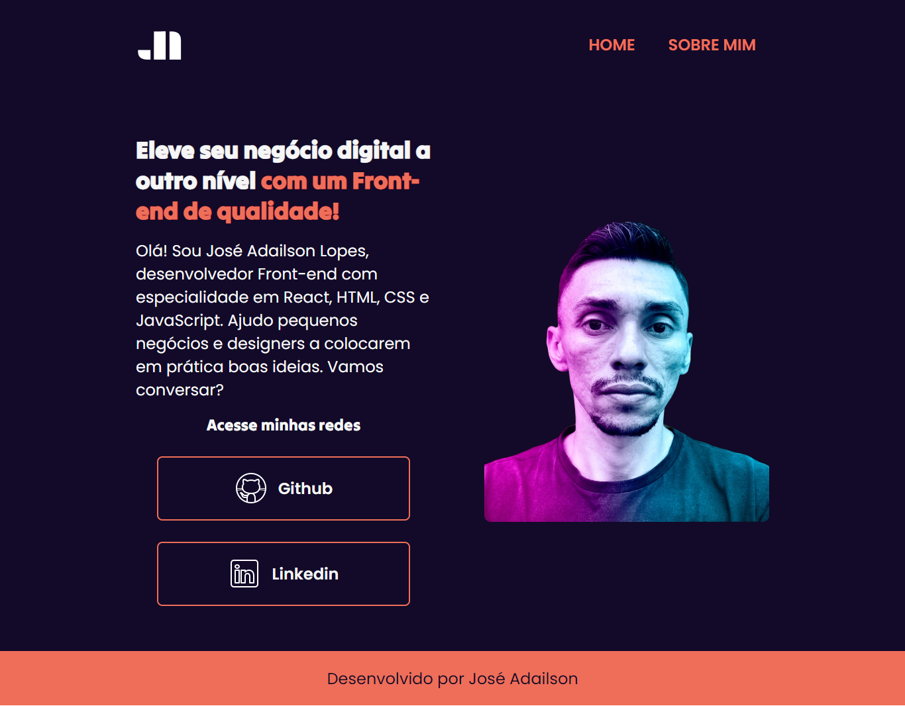

# Projeto Portfólio

Projeto inicial como criar layouts para uma página web estática da formação Iniciante em Programação T6 - Oracle Next Education.

## Screenshots

## Stacks utilizada

## Licença

